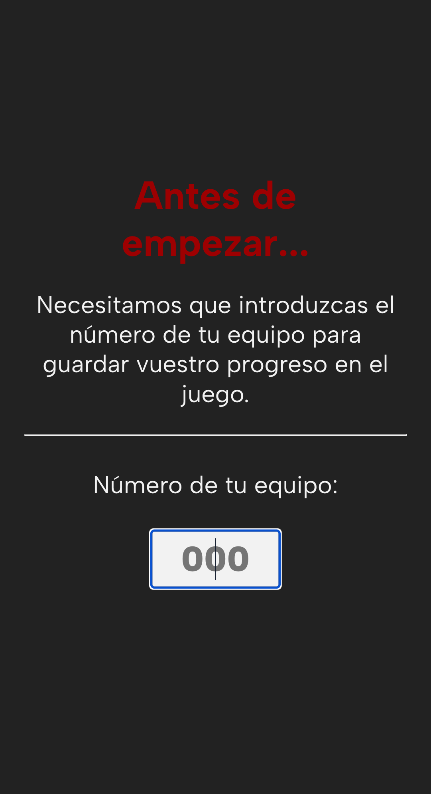
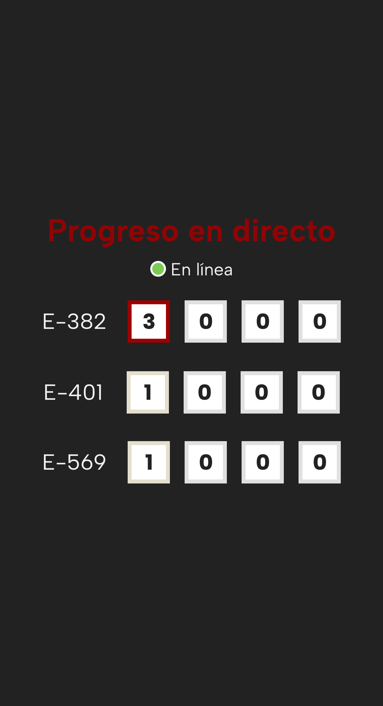

# App para la Gymkana de Mollina 2023
Esta aplicación se ha creado para apoyar de manera sencilla el desarrollo de un juego por equipos, evitando así que puedan realizarse trampas y queden equipos perjudicados.

La gymkana esta compuesta por diferentes localizaciones donde hay que resolver un acertijo, la aplicación gestiona cada una de las localizaciones y muestra el acertijo aplicando algunas reglas de juego de manera automática, evitando que tenga que haber una persona comprobando en cada una de las localizaciones.

## Despliegue
Esta aplicación utiliza Firebase como soporte donde almacenar los datos y cómo recurso de alojamiento, al ser una aplicación de tipo cliente no requiere de grandes recursos para ser puesta en ejecución.

## Tecnología
Esta aplicación ha sido diseñada en React, en su versión 18, utilizando algunos de los componentes más novedosos como ```<Suspense/>``` y librerías básicas como ```react-router-dom```.

## Screenshots

